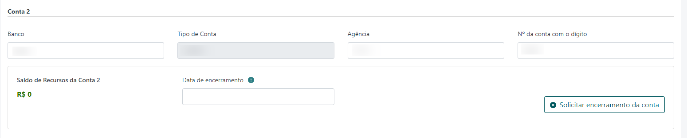
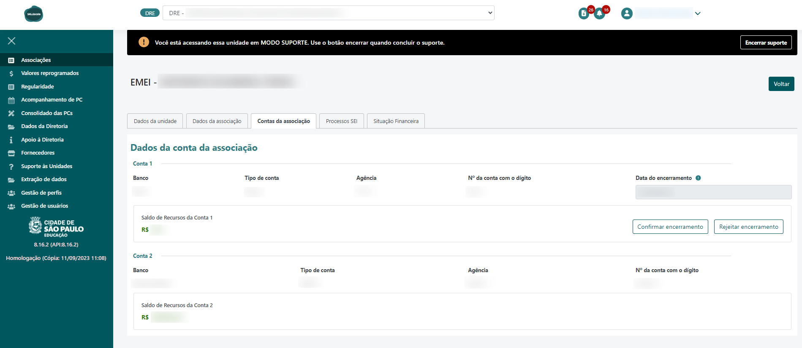

O encerramento de conta permite que contas que possuam o Saldo de Recursos da respectiva conta igual a R$0,00  e que não serão não serão mais utilizadas possam ser encerradas pela associação. Para utilizar esta opção é necessário que a conta seja do tipo que permita encerramento.

A partir do pedido do encerramento da conta não poderão mais ser feitas movimentações (lançamentos de créditos e despesas) pela associação na conta encerrada. A DRE receberá o pedido de encerramento e indicará se confirma ou rejeita o pedido de encerramento.

!!! warning "ATENÇÃO"
	Será enviada uma notificação de aviso quando o sistema verificar que a conta bancária da Associação está com saldo zerado
    e a conta é do tipo que permite encerramento.

### ***Visão Associação***

**Para fazer a solicitação de encerramento de conta:**

Deve ser informada para a data do encerramento da conta a data corrente ou datas anteriores à corrente desde que não ultrapasse a data final do período inicial de referência de uso da associação no sistema. Após confirmação do encerramento a DRE será notificada e a solicitação de encerramento ficará pendente de confirmação/rejeição pela DRE.

!!! warning "ATENÇÃO"
	Não podem existir movimentações cadastradas(despesas/créditos) após a data de encerramento informada. Nesta situação não será permitido fazer o pedido de encerramento da conta.

### ***Visão DRE***

Os dados sobre as contas ficam disponíveis na Consulta de Associações na página de Dados das contas.

A DRE pode confirmar ou rejeitar a solicitação de encerramento de conta. Após a DRE confirmar a solicitação de encerramento de conta, o sistema deve inativar a conta e incluir no histórico de contas encerradas que fica abaixo das contas ativas e a conta não será mais exibida em determinados locais do sistema.
Para rejeitar a solicitação de encerramento de conta a DRE deve indicar pelo menos um motivo de rejeição.
Após aprovação ou rejeição do pedido de encerramento de conta a associação recebe uma notificação informando sobre o resultado da solicitação de encerramento de conta. Os destinatários da notificação devem ser todos os usuários vinculados à Unidade Educacional e que tenham a permissão "recebe_notificacao_resultado_encerramento_conta".

### **Tratamento de conta encerrada nas funcionalidades**

**Visão Associação**
### **Prestação de Contas > Geração de documentos**

**Abas das contas**

A aba de conta encerrada é exibida até o período que abrange a data de encerramento da conta, fora do período de encerramento a aba da respectiva conta encerrada não é mais exibida. 

**Demonstrativo Financeiro da Conta e Relacão de bens**

A informação da data de encerramento da conta é incluída após aprovação da solicitação de encerramento pela DRE. Exemplo: caso o demonstrativo seja gerado antes da aprovação pela DRE da solicitação de encerramento de conta, não deverá ser exibida a informação de encerramento da conta. Após aprovação pela DRE da solicitação de encerramento, quando ocorrer uma nova geração de demonstrativo pela associação, a informação de encerramento será exibida. 
Não houve alteração no documento de Relação de bens quando há aprovação da solicitação de encerramento da conta.
Os documentos Demonstrativo Financeiro e Relação de bens não são gerados para conta encerrada cuja data de encerramento é anterior ao período selecionado. 

**Ata de Apresentação/Retificação da prestação de contas**

Na exibição e no download da ata não é exibida a conta encerrada cuja data de encerramento é anterior ao período selecionado.

**Observação:** é permitido fazer a geração dos documentos de contas que forem encerradas dentro do período que não foi realizada a conclusão do período.

### **Créditos e Gastos da Escola**

**Consulta de crédito/gasto**

A conta encerrada é exibida no filtro de pesquisa com a informação da data de encerramento.

**Inclusão/Edição de crédito/gasto**

Na inclusão/edição de crédito/gasto a conta encerrada é exibida a depender da situação da solicitação de encerramento conforme descrito abaixo:

|  Solicitação de encerramento pendente  | Solicitação de encerramento aprovada pela DRE  |
| ------------ | ------------ |
|Exibe a conta somente leitura com a indicação de que foi encerrada em DD/MM/AAAA (data de encerramento indicada pela associação) e não permite seleção da conta.  |  Não exibe a conta encerrada para seleção. |

**Observação:** Créditos e despesas que foram cadastrados anteriormente com o tipo de conta que foi encerrada exibem normalmente o tipo de conta informado no cadastro, porém desabilitado para seleção.

### **Conciliação Bancária**

A conta encerrada é exibida no filtro de pesquisa com a informação da data de encerramento até o período que abrange a data de encerramento ou em períodos anteriores. É permitido alterar o Saldo bancário e a conciliação/desconciliação dos gastos da conta encerrada (com solicitação de encerramento pendente ou aprovada pela DRE).

### **Resumo de recursos**

A conta encerrada é exibida no filtro de pesquisa com a informação da data de encerramento até o período que abrange a data de encerramento ou em períodos anteriores.

### **Créditos da escola: Valores reprogramados**

Ao fazer a solicitação de encerramento de conta no primeiro período de uso do sistema e a PC não foi apresentada serão verificados os Valores reprogramados informados nas seguintes condições:

|**Preenchimento/Status dos Valores reprogramados**   |  **Permite solicitação de encerramento?**  | **Mensagem exibida**  |
| ------------ | ------------ | ------------ |
|  **Não preenchidos** | Sim |Ao confirmar essa ação, sua solicitação de encerramento de conta será encaminhada para validação da Diretoria Regional De Educacao Pirituba/Jaragua. Não será mais possível cadastrar crédito, despesa ou valores reprogramados. Deseja continuar? |
| **Valores reprogramados preenchidos, mas não concluídos** | Não |Existem valores reprogramados preenchidos, mas não concluídos. É necessário finalizar o preenchimento dos Valores reprogramados para solicitar o encerramento da conta bancária. |
| ** Valores reprogramados preenchidos e concluídos com status Em conferência DRE ou Em correção UE** | Sim | O pedido de solicitação de encerramento de conta bancária foi efetuado com sucesso. Existem valores reprogramados concluídos e o encerramento definitivo da conta será realizado após a geração da PC e a conclusão da análise pela DRE. |
|  **Status dos Valores reprogramados = Valores corretos** | Sim |O pedido de solicitação de encerramento de conta bancária foi efetuado com sucesso. O encerramento definitivo da conta será realizado após a geração da PC e a conclusão da análise pela DRE |

Observação: quando houver a solicitação de encerramento de uma conta e os valores reprogramados não foram preenchidos então os campos dos valores reprogramados são exibidos como apenas visualização na tela de Valores reprogramados e não permite edição.

