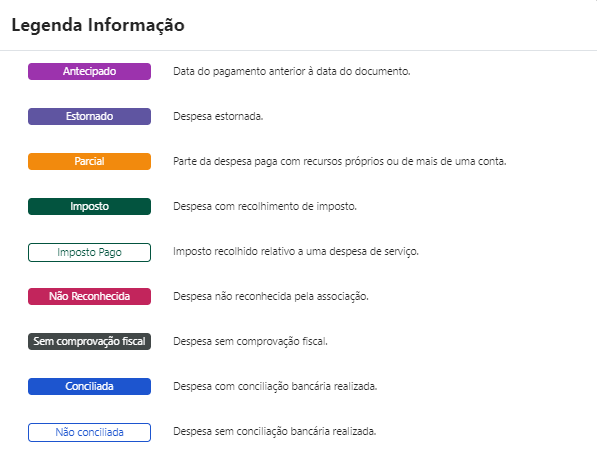
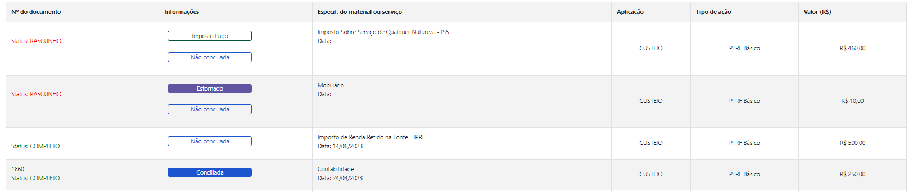
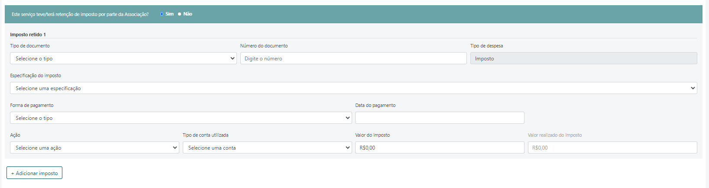

A funcionalidade de Despesas da Escola permite que sejam cadastradas todas as despesas relacionadas com a escola. As unidades educacionais possuem autonomia para decidir como investir os recursos financeiros recebidos pela Secretaria Municipal de Educação – SME. Anualmente, a Associação deve fazer o levantamento das reais necessidades da Unidade e definir os materiais, bens e serviços a serem adquiridos e/ou contratados ao longo do ano, considerando o interesse coletivo e registrar as despesas priorizadas no Plano Anual de Atividades da Associação - PAA.

**Exemplos de utilização dos recursos financeiros pelas Unidades Educacionais que devem ser cadastrados como despesas:** Reparos, pinturas, compras de materiais, contratação de serviços necessários à manutenção das escolas, desenvolvimento de atividades educacionais, implementação de projetos pedagógicos. 

## **Tipos de Despesas**

As despesas podem ser de dois tipos:

- **Despesas de custeio:** 

Consideram-se despesas de custeio aquelas relacionadas à aquisição de 
material de consumo e contratação de serviços. Exemplos: Limpeza de caixa de água, poda de árvores, serviço de lavanderia, pintura, aquisição de gêneros alimentícios, entre outros.

- **Despesas de capital:** 

Consideram-se despesas de capital, aquelas relacionadas à aquisição de materiais permanentes, ou seja, bens que em razão de seu uso corrente, não perdem a sua identidade física e/ou tem uma durabilidade superior a dois anos.

## **Status das Despesas**

As despesas podem ter dois status a depender do preenchimento feito no cadastro/edição da despesa: 

- Completo: quando todas as informações do cadastro de despesa estão preenchidas.
- Rascunho: quando não houve o preenchimento completo de todas as informações da despesa. Neste caso, esta despesa não será considerada para o cálculo do saldo do período e não será exibida na conciliação bancária e nos documentos de prestação de contas.

> **Apenas lançamentos com o status "Completo" são computados como despesas e movimentam o saldo das respetivas ações e contas.**

**No lançamento de despesas não é possível informar datas futuras nos campos data do documento e data do pagamento.**

## **Etiquetas informativas** ##

As despesas recebem etiquetas informativas conforme as informações do cadastro. As etiquetas e suas respectivas descrições são as seguintes:

| Etiqueta   | Descrição| 
|---------|-----------------------|
| Antecipado      |  Quando for informado na despesa data do pagamento anterior à data do documento.                    | 
| Estornado     |  Quando for informado que a despesa possui estorno.                    |   
| Parcial     | Quando for informado que parte da despesa é paga com recursos próprios ou de mais de uma conta.                    |
| Imposto     |  Quando for informado que a despesa possui recolhimento de imposto.                    |  
| Imposto Pago     |  Quando for informado que que a despesa possui imposto recolhido relativo a uma despesa de serviço.                    |
| Não Reconhecida     |  Quando for informado que a despesa não é reconhecida pela associação.                    |
| Sem comprovação fiscal |Quando for informado que a despesa é sem comprovação fiscal.                    |
| Conciliada     |  Quando a despesa já possui conciliação bancária.                    |
| Não conciliada     |  Quando a despesa não possui conciliação bancária.                    |

**Exibição das etiquetas com cores:**

**Exemplo de aplicação das etiquetas na Consulta de Despesas:**

**Ações para registro das despesas**

Ao fazer o cadastro de uma despesa deve ser considerado em qual ação a despesa se encaixa para a correta vinculação da despesa com a respectiva ação.

|Ação|Finalidade|
|---------|-----------------------|
|PTRF Básico|Aquisição de material permanente, material de consumo necessário ao funcionamento da Unidade Educacional, manutenção, conservação e pequenos reparos, desenvolvimento de atividades educacionais.|
|Rolê Cultural|Transporte de estudantes nas visitas aos diferentes territórios da cidade, nas atividades externas.|
|Volta às Aulas|Contratação de serviços essenciais ao início das aulas|
|Fazendo Futuro |Aquisição de insumos para o desenvolvimento de atividades realizadas no Laboratório de Informática Educativa.|
|Orçamento Grêmio Estudantil|Aquisição de bens e contratação de serviços, de acordo com os objetivos do Grêmio Estudantil.|
|Educom - Imprensa Jovem|Aquisição de equipamentos,materiais e contratação de serviços para o desenvolvimento das atividades dos projetos vinculados ao Programa Imprensa Jovem.|
|Formação|Contratação de assessores, consultores e formadores externos para desenvolver, junto à equipe escolar,cursos, seminários, palestras e oficinas que visem à formação continuada dos educadores, dos estudantes e da comunidade.|
|Mais Escola|Aquisição de materiais de consumo necessário ao desenvolvimento das oficinas no contraturno escolar e ao ressarcimento das despesas com transporte e alimentação dos voluntários responsáveis pela organização e execução das oficinas.|
|Ensino Médio|Aquisições de materiais e/ou prestação de serviços destinados às atividades e aos projetos de cunho educacional, científico, cultural, esportivo, cívico e social, dirigidos exclusivamente ao Ensino Médio.|
|Salas e Espaços de Leitura|Cobertura das despesas com ampliação do acervo e aquisição de material necessário ao funcionamento das Salas de Leitura e Espaços de Leitura.|
|Material Pedagógico|Aquisições de materiais de consumo pedagógico para uso coletivo.|
|Programa de Cuidados com as Estudantes|Disponibilização ininterrupta de absorvente descartável externo e interno para utilização das estudantes no espaço escolar. Disponibilização às estudantes de uma “cesta de higiene” que poderá conter nécessaire, lenço umedecido, desodorante sem perfume, escova de dente, creme dental, fio dental, e sabonete/sabonete líquido.|
|Sala de Recursos Multifuncionais|Aquisição de materiais didáticos e pedagógicos, de consumo e permanentes, necessários à oferta do Atendimento Educacional Especializado - AEE no contra turno, para uso coletivo no espaço escolar.|
|Material Complementar|Aquisição de material de consumo pedagógico, para uso coletivo, diferentes e/ou adicionais aos contidos nos Kits Pedagógicos, definidos em ato próprio e enviados anualmente às Unidades Educacionais.|
|Recurso externo|Despesas que utilizam recursos financeiros externos ao programa PTRF.|

**Lançamento de gastos não demonstrados ocorridos antes ou no período inicial da associação**

É permitido fazer o cadastro de uma despesa em uma data anterior ou igual à data final do período inicial (período de implantação) da Associação. Esse lançamento será exibido como uma despesa não demonstrada na conciliação bancária e nos relatórios e não influencia no saldo anterior dos períodos seguintes, uma vez que ele já foi considerado no saldo do período de implantação.  

**Cadastro de despesa sem comprovação fiscal**

É permitido fazer o cadastro de uma despesa sem comprovação fiscal. Nessa situação não é necessário informar os seguintes dados: CNPJ, Razão Social, "Tipo de documento", "Data do documento", "Número do documento", "Tipo de despesa de custeio" (para despesas classificadas como Custeio) e "Especificação do bem, material ou serviço". Se for uma despesa não reconhecida pela associação é necessário informar o Número do Boletim de Ocorrência.

**Cadastro de despesas com pagamento antecipado**

É permitido fazer o cadastro de despesas com pagamento antecipado, nessa situação devem ser indicado o(s) motivo(s) do pagamento antecipado obrigatoriamente.

**Cadastro de despesa NFS-e com recolhimento de imposto**

O tipo de documento "NFS-e" permite informar se teve/terá retenção de imposto por parte da Associação. Ao confirmar a opção, são exibidos campos para preenchimento do imposto retido. É possível adicionar mais de um imposto retido, se for necessário.

**Cadastro de estorno vinculado com a despesa**

O cadastro de estorno é permitido para despesas já cadastradas que possuam status de: Completo ou Rascunho. Qualquer que seja o motivo do estorno, este deve ser informado obrigatoriamente para o cadastro do estorno.

