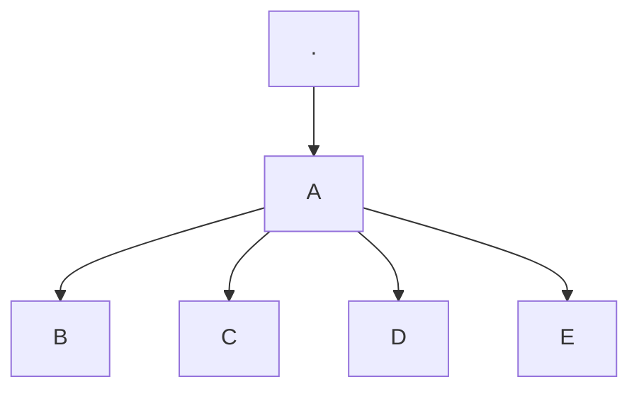

# Exemplos de uso de recursos do Mkdocs


## Cabeçalhos
Notação:
```md
# H1
## H2
### H3
#### H4
```
## Negrito
Notação:
```md
**bold text**
```
Resultado:
**bold text**

## Itálico
Notação:
```md
*italicized text*
```
Resultado:
*italicized text*

## Bloco de citação
Notação:
```md
> blockquote some text
```
Resultado:
> blockquote some text

## Listas ordenadas
Notação:
```md
1. First item
2. Second item
3. Third item
```
Resultado:

1. First item
2. Second item
3. Third item

## Listas não ordenadas
Notação:
```md
- Primeiro item
- Segundo item
- Terceiro item
```
Resultado:

- Primeiro item
- Segundo item
- Terceiro item

## Código
Notação:
```md
`Essa é uma linha de código`
```
Resultado:

`Essa é uma linha de código`

## Linha horizontal
Notação:
```md
---
```
Resultado:

---

## Link
Notação:
```md
[Markdown Guide](https://www.markdownguide.org)
```
Resultado:

[Markdown Guide](https://www.markdownguide.org)

## Imagem
Notação:
```md

```
Resultado:


## Tabela
Notação:
```md
| Nome      | e-mail        |
|-----------|---------------|
| José      | jose@net.com  |
| Maria     | maria@net.com |
```
Resultado:

| Nome      | e-mail        |
|-----------|---------------|
| José      | jose@net.com  |
| Maria     | maria@net.com |

## Bloco de código
Notação:
````md
```
{
  "nome": "José",
  "email": "jose@net.com ",
  "age": 25
}
```
````
Resultado:
```
{
  "nome": "José",
  "email": "jose@net.com ",
  "age": 25
}
```

## Lista de definições
Notação:
```md
termo
: definição

```
Resultado:

termo
: definição

## Taxado
Notação:
```md
~~A terra é plana.~~
```
Resultado:

~~A terra é plana.~~

## Destaque
Notação:
```md
Eu preciso destacar estas ==palavras muito importantes==.
```
Resultado:

Eu preciso destacar estas ==palavras muito importantes==.

## Subscrito
Notação:
```md
H~2~O
```
Resultado:

H~2~O

## Sobrescrito
Notação:
```md
X^2^
```
Resultado:

X^2^

## Diagramas (Mermaid)
Notação:
````md



````

Resultado:


## emojis
Notação:
```md
:smile: :+1: :tada: :rocket: :metal: 🤖
```
Resultado:

:smile: :+1: :tada: :rocket: :metal: 🤖

## Lista de tarefas
Notação:
```md
- [ ] Tarefa 1
- [ ] Tarefa 2
- [ ] Tarefa 3
- [ ] Tarefa 4
```

Resultado:

- [ ] Tarefa 1
- [ ] Tarefa 2
- [ ] Tarefa 3
- [ ] Tarefa 4


## Caixa de aviso
Notação:
```md
!!! warning "Título do aviso"
	Algum texto de aviso aqui. Apenas um exemplo.
    Mais uma linha de texto.
    Outra linha de texto.
```

Resultado:

!!! warning "Título do aviso"
	Algum texto de aviso aqui. Apenas um exemplo.
    Mais uma linha de texto.
    Outra linha de texto.

## Caixa de Nota 
Notação:
```md
!!! note "Título da Nota"
	Alguma nota sobre o conteúdo. Apenas um exemplo.
    Mais uma linha de texto.
    Outra linha de texto.
```

Resultado:

!!! note "Título da Nota"
	Alguma nota sobre o conteúdo. Apenas um exemplo.
    Mais uma linha de texto.
    Outra linha de texto.

## Caixa de Dica
Notação:
```md
!!! tip "Título da Dica"
	Alguma dica sobre o conteúdo. Apenas um exemplo.
    Mais uma linha de texto.
    Outra linha de texto.
```

Resultado:

!!! tip "Título da Dica"
	Alguma dica sobre o conteúdo. Apenas um exemplo.
    Mais uma linha de texto.
    Outra linha de texto.

## Caixa de Alerta
Notação:
```md
!!! tip "Título do Alerta"
	Algum alerta sobre o conteúdo. Apenas um exemplo.
    Mais uma linha de texto.
    Outra linha de texto.
```

Resultado:

!!! warning "Título do Alerta"
	Algum alerta sobre o conteúdo. Apenas um exemplo.
    Mais uma linha de texto.
    Outra linha de texto.

## Macros
Testando o uso de macros em arquivos markdown:
{{ group_test.test_macro }}

## Templates

